<body>
  <h1>🏢 HDB Resale ETL Pipeline</h1>

  

    <h3>1. Project Overview</h3>
    
This project implements an end-to-end ETL pipeline in Python to process Singapore HDB resale transaction data. 
    The pipeline follows a layered data architecture (Bronze, Silver, Gold) to ensure data quality, traceability, and scalability.

    <h3>Key Objectives:</h3>
    <ul>
      <li>Clean and standardize raw data</li>
      <li>Validate and ensure data integrity</li>
      <li>Remove duplicates using composite keys</li>
      <li>Detect anomalies in resale prices</li>
      <li>Transform data into an analytics-ready format</li>
    </ul>
  

  

    <h3>2. Input Data</h3>
    
<strong>Source:</strong> HDB resale transaction datasets       
    <strong>Format:</strong> CSV files 
     <ul>
        <li>Resale Flat Prices (Based on Approval Date), 2000 - Feb 2012.csv</li>
        <li>Resale Flat Prices (Based on Registration Date), From Jan 2015 to Dec 2016.csv</li>
        <li>Resale Flat Prices (Based on Registration Date), From Mar 2012 to Dec 2014.csv</li>
      </ul>
    <strong>Structure:</strong> Multiple files with consistent schema

    <h3>Key Fields:</h3>
    <ul>
      <li>month</li>
      <li>town</li>
      <li>flat_type</li>
      <li>block</li>
      <li>street_name</li>
      <li>storey_range</li>
      <li>floor_area_sqm</li>
      <li>flat_model</li>
      <li>lease_commence_date</li>
      <li>resale_price</li>
    </ul>
  

  

    <h3>3. ETL Pipeline Architecture</h3>
    
The pipeline is divided into seven stages (Q1–Q7), representing different layers of data processing.

    <h3>Q1 – Extraction (Bronze Layer)</h3>
    <ul>
      <li>Input: Raw CSV files</li>
      <li>Process: Merge multiple datasets, standardize column names, normalize date formats</li>
      <li>Output: Unified master dataset</li>
    </ul>
    <h3>Q2 – Profiling (Silver Layer)</h3>
    <ul>
      <li>Missing value analysis</li>
      <li>Duplicate detection</li>
      <li>Data type validation</li>
      <li>Cardinality checks</li>
      <li>Descriptive statistics</li>
      <li>Outlier identification</li>
    </ul>
    <h3>Q3 – Validation (Silver Layer)</h3>
    <ul>
      <li>Valid month format (YYYY-MM)</li>
      <li>Valid town names</li>
      <li>Valid flat types and models</li>
      <li>Valid storey range format</li>
    </ul>
    
<strong>Output:</strong> Valid dataset, Invalid dataset (for audit and traceability)

    <h3>Q4 – Lease Recalculation</h3>
    
Remaining lease is recomputed based on a 99-year lease model. Output expressed in years and months relative to the current date.

    <h3>Q5 – Deduplication</h3>
    
Composite key: All columns except resale price. Retain record with higher resale price, move lower-priced duplicates to failed dataset.

    <h3>Q6 – Anomaly Detection</h3>
    
Method: Interquartile Range (IQR), applied per town and flat type.

    <h3>Q7 – Transformation (Gold Layer)</h3>
    
Generate Resale Identifier using block digits, average resale price, month, town. Apply SHA256 hashing for uniqueness and anonymization.

  

  

    <h2>5. Jupyter Notebook</h2>
    
The repository includes: <code><b>HDB_Resale_ETL_Pipeline.ipynb</b></code>

    <ul>
      <li>Inline comments explaining each code block</li>
      <li>Markdown documentation for each ETL stage</li>
      <li>Sample outputs (df.head(), summaries, anomaly reports)</li>
      <li>Step-by-step execution guidance for reproducibility</li>
    </ul>
  

   

    <h2>6. Engineering Best Practices</h2>
    
<b>Code Quality</b>

    <ul>
      <li>Modular functions (e.g., compute_remaining_lease(), create_resale_identifier())</li>
      <li>Clear variable naming conventions</li>
      <li>Logical and readable structure</li>
    </ul>
    
<b>Explainability</b>

    <ul>
      <li>Inline comments and docstrings</li>
      <li>Markdown explanations for assumptions and logic</li>      
    </ul>
    
<b>Maintainability</b>

    <ul>
      <li>Layered architecture (Bronze, Silver, Gold)</li>
      <li>Organized folder structure (Q0–Q7)</li>
      <li>Configurable processing logic</li>    
    </ul>
    
<b>Robustness</b>

    <ul>
      <li>Validation rules to detect malformed data</li>
      <li>Deduplication ensures uniqueness</li>
      <li>Anomaly detection flags unusual records</li>
      <li>Audit datasets (invalid/failed/anomalous) preserved</li>    
    </ul>
  

  
 

    <h2>7. Error Handling & Data Quality Controls</h2>
    <ul>
      <li>Try-except blocks used during file ingestion to handle missing or corrupt files</li>
      <li>Schema validation ensures column consistency</li>
    </ul>
  

  
 

    <h2>8. Assumptions</h2>
    <ul>
      <li>HDB flats follow a 99-year lease model</li>
      <li>Duplicate records are defined using all columns except resale price</li>
      <li>Higher resale price is considered correct in duplicate cases</li>
      <li>IQR method is sufficient for anomaly detection</li>
    </ul>
  

   

    <h2>9. Output Files</h2>
    
Produce structured outputs:

  <table style="border:1px solid #000; border-collapse:collapse; width:100%;">
    <thead>
      <tr style="background-color:#f2f2f2;">
        <th style="border:1px solid #000; padding:8px;">Folder Name</th>
        <th style="border:1px solid #000; padding:8px;">Dataset / Content</th>
        <th style="border:1px solid #000; padding:8px;">Purpose</th>       
      </tr>
    </thead>
    <tbody>
      <tr>
        <td style="border:1px solid #000; padding:8px;">HDB_Raw_Dataset</td>
        <td style="border:1px solid #000; padding:8px;">Original HDB Source CSV Files</td>
        <td style="border:1px solid #000; padding:8px;">Stores the 3 original HDB datasets exactly as received, without modification.</td>    
      </tr>
      <tr>
        <td style="border:1px solid #000; padding:8px;">HDB_Master_Raw</td>
        <td style="border:1px solid #000; padding:8px;">Master Raw Dataset</td>
        <td style="border:1px solid #000; padding:8px;">Consolidates the raw HDB source files into a single dataset while preserving the original source information.</td>  
      </tr>
      <tr>
        <td style="border:1px solid #000; padding:8px;">HDB_Dataset_Cleaned</td>
        <td style="border:1px solid #000; padding:8px;">Validated & Deduplicated Dataset</td>
        <td style="border:1px solid #000; padding:8px;">Contains records that passed validation and deduplication. Invalid or rejected records are stored separately in audit datasets.</td>       
      </tr>
      <tr>
        <td style="border:1px solid #000; padding:8px;">HDB_Additional_Data_Cleaning</td>
        <td style="border:1px solid #000; padding:8px;">Cleaned Dataset (Additional Rules)</td>
        <td style="border:1px solid #000; padding:8px;">Contains data after applying additional standardisation, formatting, and data-cleaning rules beyond the initial validation.</td>        
      </tr>
      <tr>
        <td style="border:1px solid #000; padding:8px;">HDB_Transformed_Hashed</td>
        <td style="border:1px solid #000; padding:8px;">Transformed & Hashed Dataset</td>
        <td style="border:1px solid #000; padding:8px;">Transformed and hashed dataset containing Resale Identifier and SHA‑256 hash for uniqueness and anonymization.</td>
      </tr>
         <tr>
        <td style="border:1px solid #000; padding:8px;">HDB_ResalePrice_Anomaly_Detection</td>
        <td style="border:1px solid #000; padding:8px;">Resale Price Anomaly Dataset</td>
        <td style="border:1px solid #000; padding:8px;">Contains resale records classified as Normal or Anomalous, with anomaly metrics and detection reasons.</td>        
      </tr>
      <tr>
        <td style="border:1px solid #000; padding:8px;">HDB_Lease_Recalculation</td>
        <td style="border:1px solid #000; padding:8px;">Lease Recalculated Dataset</td>
        <td style="border:1px solid #000; padding:8px;">Contains the processed HDB resale data with the required lease-related values recalculated according to the defined business rules.</td>
      </tr>
    </tbody>
  </table>

The Transformed dataset includes the Resale Identifier column. Since the Hashed dataset is simply the Transformed dataset with an additional SHA‑256 hash column, both requirements are satisfied in a single output file: HDB_Transformed_Hashed.csv.

 

    <h2>10. Architecture Diagram</h2>

The diagram below illustrates the layered architecture (Bronze, Silver, Gold, Audit) and shows how data flows through each stage of the pipeline.

 
 

    <h2>11. Conclusion</h2>
    
This ETL pipeline demonstrates a robust and scalable approach to processing real-world housing data. 
    By combining data validation, deduplication, anomaly detection, and transformation, the pipeline ensures 
    high-quality, analytics-ready datasets while maintaining full traceability through audit layers.

  

</body>
</html>
